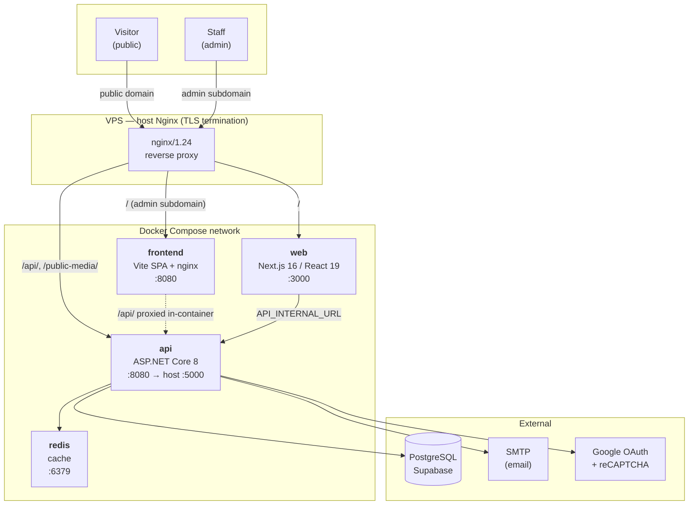
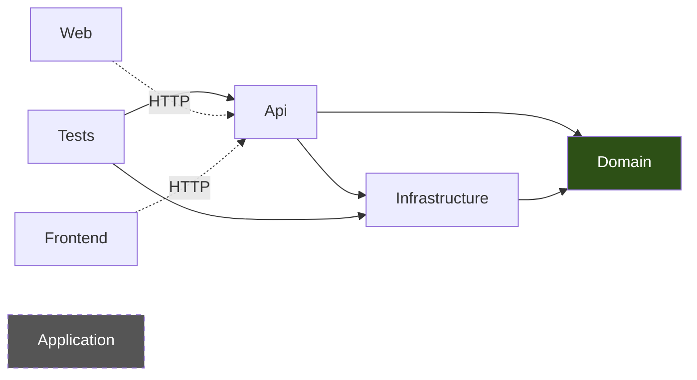
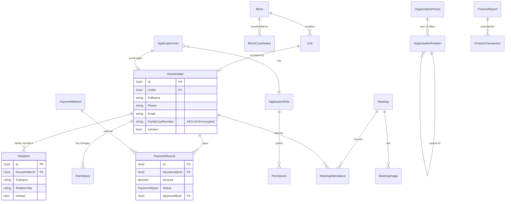
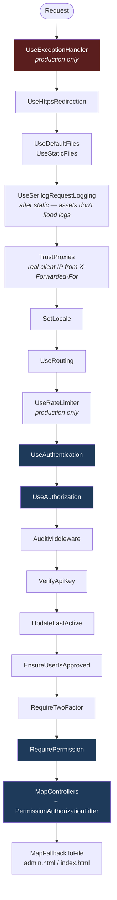
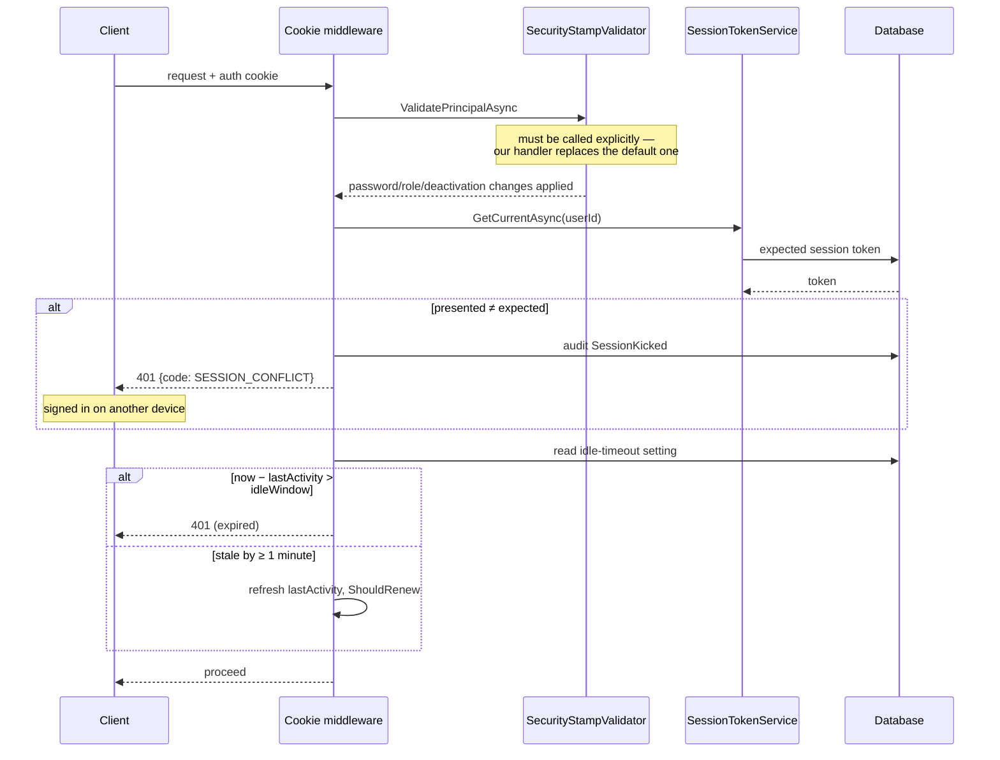
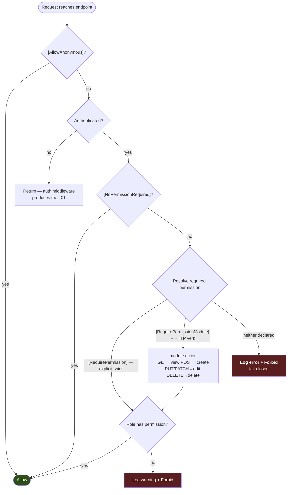
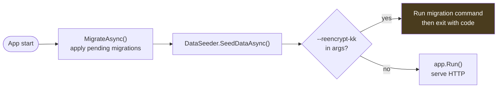

# CiviCore — Architecture & Technical Specification

How CiviCore is put together: the services, how a request travels through them, the domain
model, and the rules the system enforces.

**This document contains no secrets and is safe to commit.** Every host, key and credential
appears as a `<placeholder>`. Real values live in `.env` and `CiviCore.Api/appsettings.json`,
both gitignored — see [`appsettings.json.example`](../CiviCore.Api/appsettings.json.example).

## Related documents

| Document | Covers |
|---|---|
| [`encryption-key-migration.md`](encryption-key-migration.md) | Setting the encryption key; moving existing data onto it |
| [`aws_lightsail_docker_deployment.md`](aws_lightsail_docker_deployment.md) | Deploying to a VPS with Docker + Nginx |
| [`aws_lightsail_deployment.md`](aws_lightsail_deployment.md) | Deploying without Docker |
| [`security_strategy.md`](security_strategy.md) | SCA/SAST/DAST/VA/PT approach |

---

## 1. What CiviCore is

A residential-community management system for a housing complex. It has two faces:

- A **public site** — events, gallery, bulletins, property listings, visit scheduling.
- An **admin panel** — residents, units, payments, finance, meetings, organisation
  structure, media, users and roles.

Both talk to one ASP.NET Core API over HTTP. The API owns all business rules and all
database access.

---

## 2. System topology

Two subdomains, served by one host Nginx, backed by four containers.



**Routing rules**

| Request | Goes to |
|---|---|
| `dwipapuri.<placeholder>/` | `web` (Next.js) on `:3000` |
| `dwipapuri.<placeholder>/api/` | `api` on `:5000` |
| `dwipapuri.<placeholder>/public-media/` | `api` on `:5000` |
| `admin.dwipapuri.<placeholder>/` | `frontend` (Vite SPA) on `:8080` |
| `admin…/api/` | proxied by the container's own Nginx to `http://api:8080/api/` |

There are **two Nginx layers**: the host proxy (TLS, subdomain routing) and a second inside
the `frontend` image that serves the built SPA and does `try_files … /index.html` for
client-side routing.

---

## 3. Solution layout

Seven projects.

| Project | Type | Responsibility |
|---|---|---|
| `CiviCore.Api` | ASP.NET Core 8 | HTTP surface: 23 controllers, 8 middleware, auth filter, app services |
| `CiviCore.Domain` | class library | 24 entities, 4 enums. Plain POCOs, no dependencies |
| `CiviCore.Infrastructure` | class library | EF Core, `AppDbContext`, 22 migrations, seeding, Identity wiring, cross-cutting services |
| `CiviCore.Application` | class library | Present but currently empty — reserved layer |
| `CiviCore.Web` | Next.js 16 | Public site. React 19, Tailwind 4, App Router |
| `CiviCore.Frontend` | Vite + React 19 | Admin SPA. react-router 7, i18next, Quill editor |
| `CiviCore.Tests` | xUnit + Moq | 37 test files |



`Domain` depends on nothing. Dependencies point inward.

---

## 4. Domain model

Core entities and their relationships. (Identity tables — `AspNetUsers`, `AspNetRoles` and
friends — are omitted for readability.)



**Enums** are mapped as native PostgreSQL enum types (`HasPostgresEnum<T>()`):
`HouseStatus`, `PaymentStatus`, `FinanceReportStatus`, `FinanceTransactionType`.

**Naming.** Tables are PascalCase and quoted (`"Householders"`), not snake_case. This matters
for any hand-written SQL — an unquoted identifier gets folded to lower case and won't match.

---

## 5. Request pipeline

Order is significant. From [`Program.cs`](../CiviCore.Api/Program.cs):



Errors in production return `application/problem+json` carrying a `traceId`, which matches a
line in the log — that's how a user-reported error gets traced back.

**Rate limits** (production only):

| Policy | Limit | Partition |
|---|---|---|
| Global | 100 requests / minute | per IP |
| `AuthLimit` | 5 requests / minute | per IP |

Static files are served *before* the limiter, so images and CSS don't consume the budget.

---

## 6. Authentication & session

Cookie-based ASP.NET Identity. No JWT for browser sessions. Google OAuth is registered as an
external provider with callback `/auth/google/callback`.

Three rules are enforced on **every** request, inside `OnValidatePrincipal`
([`DependencyInjection.cs`](../CiviCore.Infrastructure/DependencyInjection.cs)):



**Single session per account.** Each login mints a session token; a cookie presenting a
superseded token is rejected with `SESSION_CONFLICT` so the client can explain *why* rather
than silently bouncing to `/login`.

**Idle timeout** is admin-configurable at runtime (`ISessionSettingsService`) and always
`<= ExpireTimeSpan`. The cookie is only reissued once activity is ≥ 1 minute stale, keeping
`Set-Cookie` off most responses.

**Cookie flags:** `HttpOnly`, `SameSite=Lax`, `Secure` always in production
(`SameAsRequest` in development so plain-HTTP local dev works).

**Password policy:** ≥ 8 characters, must contain a digit, lockout after 5 failed attempts.

**Data Protection keys** persist to `/app/DataProtection-Keys` with application name
`CiviCore`. In the current compose file this directory is *not* volume-mounted, so keys are
regenerated when the container is rebuilt — which invalidates existing auth cookies and
forces users to sign in again.

---

## 7. Authorization — the permission model

Permissions are enforced **server-side** by a globally registered filter. Hiding buttons in
the UI is not a control.



**Fail-closed is the key property.** An authenticated endpoint that declares no permission is
**denied and logged as an error**, not left open. A forgotten attribute breaks loudly instead
of quietly exposing data.

Permission keys follow `module.action` — `householders.delete`, `payments.view`. The role name
travels in the auth cookie, so the common path costs no database round-trip.

`PermissionMapTests` pins controller actions to their expected permission keys, so a renamed
action can't silently drop its guard.

---

## 8. Data & persistence

- **PostgreSQL** (Supabase-hosted), accessed via **EF Core** + **Npgsql**.
- Connection string: `ConnectionStrings:SupabaseConnection`.
- `AppDbContext` extends `IdentityDbContext<ApplicationUser, ApplicationRole, Guid>`.
- **22 migrations** in `CiviCore.Infrastructure/Migrations`.

**Startup applies migrations and seeds automatically:**



Note the ordering: migrations and seeding run **before** the maintenance-command check, so
`--reencrypt-kk` also applies any pending migrations as a side effect. Failures in this block
are caught and logged, not fatal.

`AuditLog` is indexed on `CreatedAt`, `(UserId, CreatedAt)` and `Event` — the table only grows,
and those are the queries that matter.

---

## 9. Encryption at rest

**Exactly one field is encrypted: `Householder.FamilyCardNumber` (Nomor KK).** Names, phone
numbers, emails and addresses are stored in plaintext.

- **Cipher:** AES-GCM, 12-byte random nonce per value, 16-byte tag.
- **Stored form:** base64 of `nonce ‖ tag ‖ ciphertext`.
- **Key:** `Encryption:Key`, supplied via `ENCRYPTION_KEY` in `.env`. Must be **exactly 32
  characters** — shorter is padded, longer truncated.

`docker-compose.yml` uses `${ENCRYPTION_KEY:?…}`, so **compose refuses to start without it**.

Two decrypt paths exist, deliberately:

| Method | On failure | Use |
|---|---|---|
| `Decrypt()` | returns input unchanged | read paths, tolerates legacy plaintext |
| `TryDecrypt()` | returns `false` | key migration — must not re-encrypt what it couldn't open |

Setting a new key without migrating existing data leaves it unreadable. See
[`encryption-key-migration.md`](encryption-key-migration.md).

---

## 10. Media & storage

`LocalStorageService` writes to two locations, split by whether the file should be public:

| Path | Purpose | Exposure |
|---|---|---|
| `/app/wwwroot/public-media` | images shown on the public site | served directly |
| `/app/App_Data/PrivateMedia` | restricted documents | via `MediaController` only |

Both are bind-mounted to the host so they survive container rebuilds. Nginx caps uploads at
2 MB (`client_max_body_size`); the application limit is 1 MB.

---

## 11. Caching, logging, audit

**Cache.** Redis via `AddStackExchangeRedisCache` (instance prefix `CiviCore_`) when
`UseRedis` is true and a Redis connection string is present; otherwise an in-memory cache.
The registration is lazy — no connection is made at startup.

**Logging.** Serilog, configured in code rather than `appsettings.json` (that file is
gitignored, so a fresh clone or CI build would otherwise produce no logs).

- Console — keeps `docker compose logs api` working.
- Rolling file at `/app/logs/civicore-.log` → host `./logs`. Daily, 20 MB cap, 14 files
  retained, so it cannot fill the disk.
- EF Core and Microsoft noise suppressed to `Warning`.

**Audit.** `AuditMiddleware` + `IAuditService` record security-relevant events (including
`SessionKicked`) with the caller's IP and user-agent, resolved through `TrustProxies` so the
real client IP is recorded rather than the proxy's.

---

## 12. Configuration

Two sources, and the split is deliberate.

**`.env`** — read by `docker-compose.yml`. Gitignored.

```
ENCRYPTION_KEY=<32 characters>
ENCRYPTION_OLD_KEY=<only when rotating>
```

**`CiviCore.Api/appsettings.json`** — gitignored; see
[`appsettings.json.example`](../CiviCore.Api/appsettings.json.example) for the shape.

| Section | Holds |
|---|---|
| `ConnectionStrings:SupabaseConnection` | PostgreSQL connection |
| `Supabase:Url`, `Supabase:ServiceRoleKey` | Supabase project + service-role credential |
| `Google:ClientId`, `Google:ClientSecret` | OAuth |
| `MailSettings` | SMTP |
| `Recaptcha:SiteKey`, `Recaptcha:SecretKey` | reCAPTCHA |
| `UseRedis` | cache toggle |

> `.dockerignore` does not exclude `appsettings.json`, so `COPY . .` bakes it into the image.
> Anything placed there ships inside the artifact. This is why `Encryption:Key` is passed via
> the environment instead — keep it out of this file.

**Environment variables** (compose → configuration, `__` becomes `:`):

| Variable | Maps to |
|---|---|
| `ENCRYPTION_KEY` | `Encryption:Key` |
| `ENCRYPTION_OLD_KEY` | `Encryption:OldKey` |
| `ConnectionStrings__Redis` | `ConnectionStrings:Redis` |
| `FrontendUrl` | CORS / redirect target |
| `ASPNETCORE_ENVIRONMENT` | `Production` in compose |

---

## 13. Build, run, deploy

**Local development**

```bash
# API — needs appsettings.json and an encryption key in the environment
dotnet run --project CiviCore.Api

# Public site
cd CiviCore.Web && npm run dev

# Admin SPA
cd CiviCore.Frontend && npm run dev
```

Swagger is exposed at `/api/swagger` in Development only.

**Containers**

```bash
docker compose build
docker compose up -d
```

`CiviCore.Api/Dockerfile` is a two-stage build (SDK → aspnet runtime), runs as the non-root
`app` user, and uses exec-form `ENTRYPOINT ["dotnet", "CiviCore.Api.dll"]` — which is why
maintenance flags append cleanly:

```bash
docker compose run --rm api --reencrypt-kk --dry-run
```

**Maintenance commands**

| Command | Effect |
|---|---|
| `--reencrypt-kk --dry-run` | report only; writes nothing |
| `--reencrypt-kk --apply` | re-encrypt onto the current key; exit `2` if any row was undecryptable |

Deployment to a VPS is covered in
[`aws_lightsail_docker_deployment.md`](aws_lightsail_docker_deployment.md).

---

## 14. Testing

`CiviCore.Tests` — xUnit with Moq, 37 files. `TestBase` supplies an EF context and helpers for
setting the controller's user and roles.

| Suite | Pins |
|---|---|
| `PermissionMapTests` | controller actions ↔ permission keys |
| `HouseholderPrivacyTests` | Nomor KK never leaves the API on read paths |
| `ReEncryptCommandTests` | idempotency; undecryptable rows left untouched |
| `BulkDeleteTests` | referential guards (e.g. a unit with householders can't be deleted) |
| `DashboardControllerTests` | statistics aggregation |

```bash
dotnet test
```

Tests construct `EncryptionService` with an explicit key rather than relying on configuration,
so they are independent of the environment.
